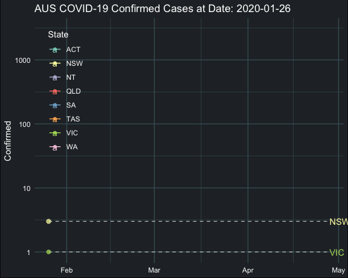

```{r setup, include = FALSE}
# The README markdown generate by this rmd file, please edit the content within this R markdown.
knitr::opts_chunk$set(
  collapse = TRUE,
  message = FALSE,
  fig.path = "image/",
  fig.align = "center",
  echo = FALSE
)
```

# Dashboard for COVID-19 Outbreak Situation

Link to dashboard: https://jiaying-wu.github.io/COVID-19.github.io/

## Key Features

### 3D Interactive Cumulative Cases World Map


### Animation of Cumulative Cases Curves



### 2D Cumulative Cases Heat Map


## Data File

1.`index.Rmd`: R markdown contain source code to generate the flex dashboard, `index.html` is the output of this R markdown.

2.`READEME.Rmd`: R markwon to generate this READEME file, `README.md` is the ouput.

## Data Source

1.The COVID-19 data is from John Hopkins University,  https://github.com/CSSEGISandData/COVID-19/tree/master/csse_covid_19_data/csse_covid_19_time_series. 

2.The Australia map data is from GADM, https://gadm.org/data.html

3.The country code is from plotly dataset, https://github.com/plotly/datasets/blob/master/2014_world_gdp_with_codes.csv

