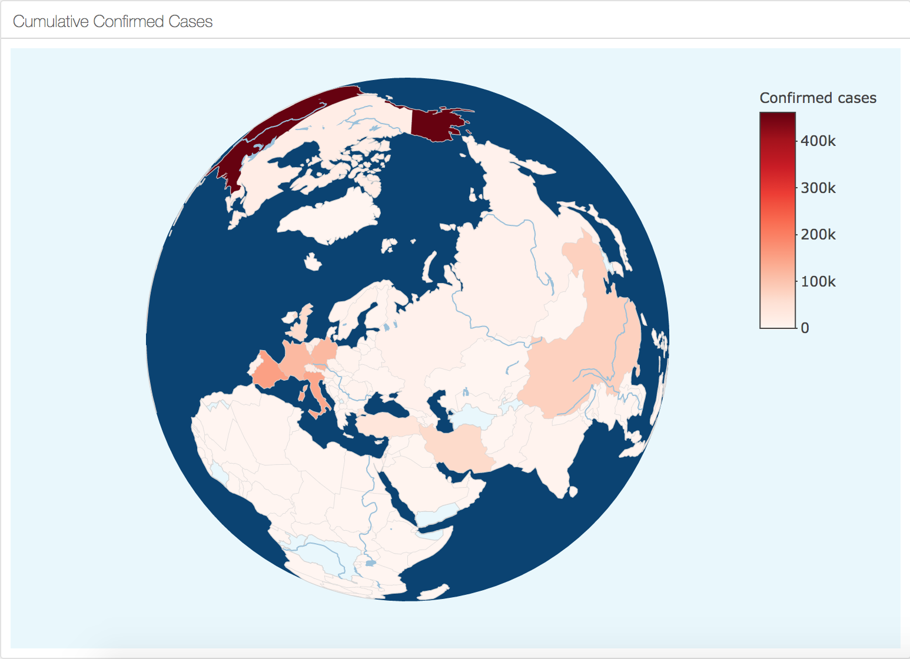

Flex Dashboard for COVID-19 Outbreak Situation
==============================================

Link to the flex dashboard: <https://jiaying-wu.github.io/COVID-19.github.io/>

Key Features
------------

### 3D Interactive Cumulative Cases World Map

### Animation of Cumulative Cases Curves

### 2D Cumulative Cases Heat Map

Data File
---------

1.`index.Rmd`: R markdown contain source code to generate the flex dashboard, `index.html` is the output of this R markdown.

2.`READEME.Rmd`: R markwon to generate this READEME file, `README.md` is the ouput.

Data Source
-----------

The data source of this flex dashboard from this dataset in Kaggle: [Novel Corona Virus 2019 Dataset](https://www.kaggle.com/sudalairajkumar/novel-corona-virus-2019-dataset).
