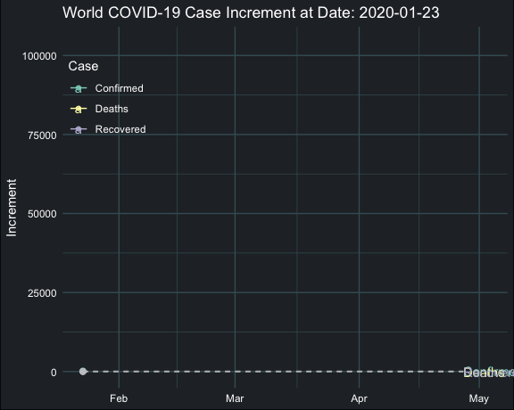
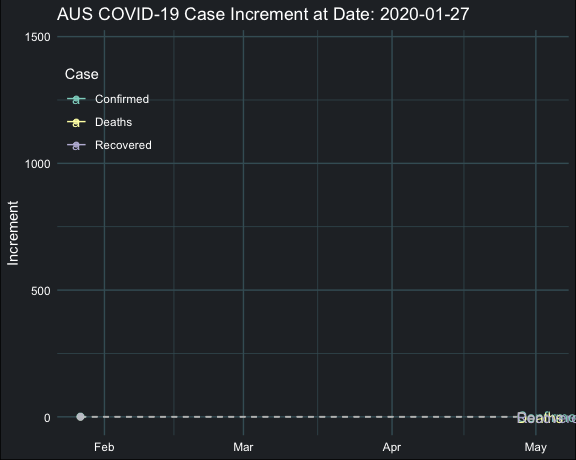
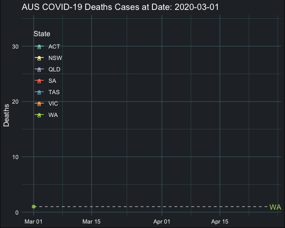

```{r setup, include=FALSE}
library(flexdashboard)
library(tidyverse)
library(lubridate)
library(plotly)
library(ggthemes)
library(knitr)
library(DT)
library(rmapshaper)
library(sugarbag)
library(gganimate)
library(brotools)
```

Summary
=======================================================================

Column {data-width=600 .tabset}
-----------------------------------------------------------------------

### Confirmed Cases in Regions

```{r time_series}
# time series of confirmed cases in each area
ts_confirmed <- read_csv(
  file = "https://raw.githubusercontent.com/CSSEGISandData/COVID-19/master/csse_covid_19_data/csse_covid_19_time_series/time_series_covid19_confirmed_global.csv",
  col_types = cols(
    .default = col_double(),
    `Province/State` = col_character(),
    `Country/Region` = col_character()
  )) %>%
  pivot_longer(cols = -c(`Province/State`, `Country/Region`, Lat, Long), names_to = "Date", values_to = "Confirmed") %>%
  mutate(Date = mdy(Date))

# time series of recovered cases in each area
ts_recovered <- read_csv(
  file = "https://raw.githubusercontent.com/CSSEGISandData/COVID-19/master/csse_covid_19_data/csse_covid_19_time_series/time_series_covid19_recovered_global.csv",
  col_types = cols(
    .default = col_double(),
    `Province/State` = col_character(),
    `Country/Region` = col_character()
  )) %>%
  pivot_longer(cols = -c(`Province/State`, `Country/Region`, Lat, Long), names_to = "Date", values_to = "Recovered") %>%
  mutate(Date = mdy(Date))

# time series of deaths cases in each area
ts_deaths <- read_csv(
  file = "https://raw.githubusercontent.com/CSSEGISandData/COVID-19/master/csse_covid_19_data/csse_covid_19_time_series/time_series_covid19_deaths_global.csv",
  col_types = cols(
    .default = col_double(),
    `Province/State` = col_character(),
    `Country/Region` = col_character()
  )) %>%
  pivot_longer(cols = -c(`Province/State`, `Country/Region`, Lat, Long), names_to = "Date", values_to = "Deaths") %>%
  mutate(Date = mdy(Date))

# time series of 3 cases in each area
ts_all <- ts_confirmed %>%
  left_join(ts_recovered) %>%
  mutate(Recovered = replace_na(Recovered, replace = 0)) %>%
  left_join(ts_deaths) %>%
  mutate(Deaths = replace_na(Deaths, replace = 0))

# recent case by region
region_recent <- ts_all %>%
  filter(Date == max(Date)) %>%
  group_by(`Country/Region`, Date) %>%
  summarise(Confirmed = sum(Confirmed),
            Recovered = sum(Recovered),
            Deaths = sum(Deaths))
```

```{r country_code}
# get country code
code <- read_csv('https://raw.githubusercontent.com/plotly/datasets/master/2014_world_gdp_with_codes.csv',
                 col_types = cols(
                   COUNTRY = col_character(),
                   `GDP (BILLIONS)` = col_double(),
                   CODE = col_character()
                 )) %>%
  select(COUNTRY, CODE) %>%
  rename(Region = COUNTRY,
         Code = CODE) %>%
  rownames_to_column("id")
code$id <- as.integer(code$id)
```

```{r replace_region_name}
# Rename the unmatched region name in code
code$Region <- code$Region %>%
  str_replace(pattern = "United States", replacement = "US") %>%
  str_replace(pattern = "Macedonia", replacement = "North Macedonia") %>%
  str_replace(pattern = "Czech Republic", replacement = "Czechia") %>%
  str_replace(pattern = "Taiwan", replacement = "Taiwan*") %>%
  str_replace(pattern = "West Bank", replacement = "West Bank and Gaza") %>%
  str_replace(pattern = "Congo, Democratic Republic of the", replacement = "Congo (Kinshasa)") %>%
  str_replace(pattern = "Congo, Republic of the", replacement = "Congo (Brazzaville)") %>%
  str_replace(pattern = "Bahamas, The", replacement = "Bahamas") %>%
  str_replace(pattern = "Swaziland", replacement = "Eswatini") %>%
  str_replace(pattern = "Gambia, The", replacement = "Gambia")
  #str_replace(pattern = "", replacement = "Holy See") %>%
  #str_replace(pattern = "", replacement = "Western Sahara")
```

```{r recent_case_cumulative}
# recent cumulative case and join daily case summary with code name
# remove Diamond Princess and MS Zaandam, they are boat, not region
region_recent_code <- region_recent %>%
  filter(`Country/Region` != "Diamond Princess") %>%
  filter(`Country/Region` != "MS Zaandam") %>%
  left_join(code, by = c("Country/Region" = "Region")) %>%
  arrange(desc(Confirmed))
```

```{r set_map}
#Set country boundaries as light grey
line <- list(color = toRGB("#d1d1d1"), width = 0.2)

#Specify map projection and options
geo <- list(
     showframe = FALSE,
     showcoastlines = FALSE,
     projection = list(type = 'orthographic'),
     resolution = '100',
     showcountries = TRUE,
     countrycolor = '#d1d1d1',
     showocean = TRUE,
     oceancolor = '#064273',
     showlakes = TRUE,
     lakecolor = '#99c0db',
     showrivers = TRUE,
     rivercolor = '#99c0db',
     bgcolor = '#e8f7fc')

```

```{r confirm_map_3d}
confirm_map_3d <- plot_geo() %>%
  layout(geo = geo,
         paper_bgcolor = '#e8f7fc') %>%
  add_trace(data = region_recent_code,
            z = ~Confirmed, 
            color = ~Confirmed, 
            colors = 'Reds',
            text = ~`Country/Region`,
            locations = ~Code, 
            marker = list(line = line))

confirm_map_3d
```

### Search by Region

```{r table_case}
region_recent_code %>%
  select(`Country/Region`,Code, Date, Confirmed, Recovered, Deaths) %>%
  arrange(desc(Confirmed)) %>%
  datatable(
    rownames = FALSE,
    fillContainer = TRUE,
    options = list(
      bPaginate = FALSE)
  )
```

Column {data-width=400 .bg-secondary}
-----------------------------------------------------------------------

```{r total_summary_cases}
# aggregate in date level
ts_all_date <- ts_all %>%
  rename(Region = `Country/Region`) %>%
  group_by(Date) %>%
  summarise(Confirmed = sum(Confirmed),
            Deaths = sum(Deaths),
            Recovered = sum(Recovered))
ts_recent <- ts_all_date %>%
  filter(Date == max(Date))
```

### `r paste0("Confirmed Cases at ", ts_recent$Date)` 

```{r total_confirmed}
valueBox(prettyNum(ts_recent$Confirmed, big.mark = ","), icon = "fa-users", color = "#C70039")
```

### `r paste0("Recovered Cases at ", ts_recent$Date)` 

```{r total_recovered}
valueBox(prettyNum(ts_recent$Recovered, big.mark = ","), icon = "ion-checkmark-circled", color = '#3FBF7F')
```

### `r paste0("Deaths Cases at ", ts_recent$Date)` 

```{r total_deaths}
valueBox(prettyNum(ts_recent$Deaths, big.mark = ","), icon = "ion-close-circled", color = '#d3d3d3')
```

### `r paste0("Affected Country/Region at ", ts_recent$Date)` 

```{r affect_region}
affect_region <- NROW(region_recent_code)
valueBox(prettyNum(affect_region, big.mark = ","), icon = "ion-android-globe", color = '#835bd4')
```

```{r first_case_day}
case_nz <- ts_all %>% filter(Confirmed>0)
first_case_day <- min(case_nz$Date)
```

### `r paste0("Days since First Case Confirmed at ", first_case_day)` 

```{r pass_day}
current <- Sys.Date()
pass_day <- current - first_case_day
valueBox(prettyNum(pass_day, big.mark = ","), icon = "ion-android-time", color = '#FFC300')
```


World
=======================================================================

Column {data-width=500}
-----------------------------------------------------------------------

### Cumulative Cases in the World

```{r barchart_cum}
ts_date_long <- ts_all_date %>% 
    select(-Confirmed) %>%
    pivot_longer(cols = -Date, names_to = "Status", values_to = "Cases")
barchart <- ggplot(data = ts_all_date, aes(x = Date)) +
  geom_bar(aes(y = Confirmed), position = "stack", stat = "identity", fill = "#ff5050") +
  geom_bar(data = ts_date_long, aes(y = Cases, fill = Status), position = "stack", stat = "identity") +
  scale_fill_manual(values = c("#000000", "#009900")) +
  scale_y_continuous(labels = scales::label_number_si(accuracy = 0.1)) +
  theme_solarized(base_size = 10, light = TRUE)+
  theme(plot.margin = margin(0, 0, 0, 0, "pt"),
        panel.background = element_rect(fill = "White"),
        legend.position = "bottom",
        axis.title = element_blank(),
        #axis.text.y = element_blank(),
        axis.ticks = element_blank())

ggplotly(barchart) %>% 
  layout(legend = list(orientation = 'h'))
```

Column {data-width=500}
-----------------------------------------------------------------------

### Case Increment in the World

```{r ts_increment}
ts_increment_long <- ts_all_date %>%
  mutate(Confirmed = Confirmed - lag(Confirmed,1),
            Deaths = Deaths - lag(Deaths,1),
            Recovered = Recovered - lag(Recovered,1)) %>%
  filter(Date != min(Date)) %>%
  pivot_longer(-Date, names_to = "Case", values_to = "Increment")
```

```{r animate_world_increment}
animate_world_increment <- 
  ggplot(data = ts_increment_long, 
         mapping = aes(x = Date, y = Increment, group = Case, color = Case)) +
  geom_line() +
  scale_color_brewer(palette = "Set3") +
  geom_segment(aes(xend = max(Date)+1, yend = Increment), linetype = 2, colour = 'grey') +
  geom_text(aes(x = max(Date)+1, label = Case), hjust = 0) +
  theme_blog() +
  coord_cartesian(xlim = c(min(ts_increment_long$Date), max(ts_increment_long$Date)+7), clip = 'off') +
  theme(legend.position = "none", axis.title.x = element_blank()) +
  guides(size = FALSE) + 
  geom_point(aes(size = Increment), alpha = 0.7) +
  scale_size(range = c(2, 10)) +
  transition_reveal(Date) +
  labs(title = 'Case Increment at Date: {frame_along}')

#anim_save("image/animate_world_increment.gif", animation = animate(animate_world_increment, nframes = 200, fps = 10, end_pause = 50))
```




Australia
=======================================================================
    
```{r map_aus_ts_recent}
ts_aus <- ts_all %>%
  filter(`Country/Region` == "Australia") %>%
  rename(State = `Province/State`,
         Country = `Country/Region`)

aus_map <- read_rds(gzcon(url("https://biogeo.ucdavis.edu/data/gadm3.6/Rsf/gadm36_AUS_1_sf.rds"))) %>%
  ms_simplify(keep = 0.01, keep_shapes = TRUE) %>%
  fortify_sfc() %>%
  filter(NAME_1 != "Ashmore and Cartier Islands" & 
           NAME_1 != "Coral Sea Islands Territory" &
           NAME_1 != "Jervis Bay Territory") %>%
  select(NAME_1, polygon, long, lat) %>%
  rename(State = NAME_1)

aus_map_recent <- aus_map %>%
  left_join(ts_aus %>% filter(Date == max(Date)), by = "State") %>%
  select(-Country)
```

Column {data-width=500 .tabset}
-----------------------------------------------------------------------

### Map of Confirmed Cases

```{r map_aus_confirmed}
ggplot() +
  geom_polygon(data = aus_map_recent,
               mapping = aes(x = long, y = lat, group = interaction(State, polygon), fill = Confirmed), 
               color = "grey") +
  geom_text() +
  theme_map() +
  scale_fill_distiller(palette = "YlOrRd", direction = 1) +
  theme(plot.margin = margin(0, 0, 0, 0, "pt"),
        panel.background = element_rect(fill = "lightblue"),
        legend.position = c(0.26, 0.2),
        legend.direction = "horizontal",
        legend.background = element_rect(fill = "lightblue")) +
  ggtitle("Recent Cumulative Confirmed Cases in Australia") +
  geom_text(data = aus_map_recent, 
            mapping = aes(x = Long,y = Lat, label = paste(State,":",Confirmed)), 
            size = 2)
```

### Recovered Cases

```{r map_aus_recovered}
ggplot() +
  geom_polygon(data = aus_map_recent, 
               mapping = aes(x = long, y = lat, group = interaction(State, polygon), fill = Recovered), 
               color = "grey") +
  theme_map() +
  scale_fill_distiller(palette = "Greens", direction = 1) +
  theme(plot.margin = margin(0, 0, 0, 0, "pt"),
        panel.background = element_rect(fill = "lightblue"),
        legend.position = c(0.26, 0.2),
        legend.direction = "horizontal",
        legend.background = element_rect(fill = "lightblue")) +
  ggtitle("Recent Cumulative Recovered Cases in Australia") +
  geom_text(data = aus_map_recent, 
            mapping = aes(x = Long,y = Lat, label = paste(State,":",Recovered)), 
            size = 2)
```

### Deaths Cases

```{r map_aus_deaths}
ggplot() +
  geom_polygon(data = aus_map_recent, 
               mapping = aes(x = long, y = lat, group = interaction(State, polygon), fill = Deaths), 
               color = "grey") +
  theme_map() +
  scale_fill_distiller(palette = "Purples", direction = 1) +
  theme(plot.margin = margin(0, 0, 0, 0, "pt"),
        panel.background = element_rect(fill = "lightblue"),
        legend.position = c(0.26, 0.2),
        legend.direction = "horizontal",
        legend.background = element_rect(fill = "lightblue")) +
  ggtitle("Recent Cumulative Deaths Cases in Australia") +
  geom_text(data = aus_map_recent, 
            mapping = aes(x = Long,y = Lat, label = paste(State,":",Deaths)), 
            size = 2)
```


Column {data-width=500 .tabset}
-----------------------------------------------------------------------

```{r ts_aus_nz}
state_code <- tibble(
  "name" = c("Australian Capital Territory", "New South Wales", "Northern Territory", "Queensland", "South Australia","Tasmania", "Victoria","Western Australia"),
  "State" = as.factor(c("ACT", "NSW", "NT", "QLD", "SA", "TAS", "VIC", "WA")))

# filter by the first confirmed case appeareds
ts_aus_nz <- ts_aus %>%
  rename(name = State) %>%
  filter(Confirmed > 0) %>%
  left_join(state_code)
```

### Animation of Case Increment

```{r ts_increment_aus}
ts_increment_aus_long <- ts_aus_nz %>%
  select(Date, Confirmed, Recovered, Deaths, State) %>%
  group_by(State) %>%
  mutate(Confirmed = Confirmed - lag(Confirmed,1),
            Deaths = Deaths - lag(Deaths,1),
            Recovered = Recovered - lag(Recovered,1)) %>%
  filter(Date != min(Date)) %>%
  ungroup() %>%
  group_by(Date) %>%
  summarise(Confirmed = sum(Confirmed),
            Recovered = sum(Recovered),
            Deaths = sum(Deaths)) %>%
  pivot_longer(-Date, names_to = "Case", values_to = "Increment")
```

```{r animate_aus_increment}
animate_aus_increment <- 
  ggplot(data = ts_increment_aus_long, 
         mapping = aes(x = Date, y = Increment, group = Case, color = Case)) +
  geom_line() +
  scale_color_brewer(palette = "Set3") +
  geom_segment(aes(xend = max(Date)+1, yend = Increment), linetype = 2, colour = 'grey') +
  geom_text(aes(x = max(Date)+1, label = Case), hjust = 0) +
  theme_blog() +
  coord_cartesian(xlim = c(min(ts_increment_aus_long$Date), max(ts_increment_aus_long$Date)+7), clip = 'off') +
  theme(legend.position = "none", axis.title.x = element_blank()) +
  guides(size = FALSE) + 
  geom_point(aes(size = Increment), alpha = 0.7) +
  scale_size(range = c(2, 10)) +
  transition_reveal(Date) +
  labs(title = 'AUS Case Increment at Date: {frame_along}')

#anim_save("image/animate_aus_increment.gif", animation = animate(animate_aus_increment, nframes = 200, fps = 10, end_pause = 50))
```



### Confirmed Cases

```{r animate_confirmed}
animate_confirmed <- 
  ggplot(data = ts_aus_nz, 
         mapping = aes(x = Date, y = Confirmed, group = State, color = State)) +
  geom_line() +
  scale_color_brewer(palette = "Set3") +
  scale_y_log10() +
  geom_segment(aes(xend = max(Date)+1, yend = Confirmed), linetype = 2, colour = 'grey') +
  geom_text(aes(x = max(Date)+1, label = State), hjust = 0) +
  theme_blog() +
  coord_cartesian(clip = 'off') +
  theme(legend.position = "none", axis.title.x = element_blank()) +
  guides(size = FALSE) + 
  geom_point(aes(size = Confirmed), alpha = 0.7) +
  scale_size(range = c(2, 10)) +
  transition_reveal(Date) +
  labs(title = 'Cumulative Confirmed Cases at Date: {frame_along}')

#anim_save("image/animate_confirmed.gif", animation = animate(animate_confirmed, nframes = 200, fps = 10, end_pause = 50))
```


### Recovered Cases

```{r animate_recovered}
ts_aus_nz_recovered <- ts_aus_nz %>%
  filter(Recovered > 0)
animate_recovered <- 
  ggplot(data = ts_aus_nz_recovered, 
         mapping = aes(x = Date, y = Recovered, group = State, color = State)) +
  geom_line() +
  scale_color_brewer(palette = "Set3") +
  scale_y_log10() +
  geom_segment(aes(xend = max(Date)+1, yend = Recovered), linetype = 2, colour = 'grey') +
  geom_text(aes(x = max(Date)+1, label = State), hjust = 0) +
  theme_blog() +
  coord_cartesian(clip = 'off') +
  theme(legend.position = "none", axis.title.x = element_blank()) +
  guides(size = FALSE) + 
  geom_point(aes(size = Recovered), alpha = 0.7) +
  scale_size(range = c(2, 10)) +
  transition_reveal(Date) +
  labs(title = 'Cumulative Recovered Cases at Date: {frame_along}')

#anim_save("image/animate_recovered.gif", animation = animate(animate_recovered, nframes = 200, fps = 10, end_pause = 50))
```


### Deaths Cases

```{r animate_deaths}
ts_aus_nz_deaths <- ts_aus_nz %>%
  filter(Deaths > 0)
animate_deaths <- 
  ggplot(data = ts_aus_nz_deaths, 
         mapping = aes(x = Date, y = Deaths, group = State, color = State)) +
  geom_line() +
  scale_color_brewer(palette = "Set3") +
  geom_segment(aes(xend = max(Date)+1, yend = Deaths), linetype = 2, colour = 'grey') +
  geom_text(aes(x = max(Date)+1, label = State), hjust = 0) +
  theme_blog() +
  coord_cartesian(clip = 'off') +
  theme(legend.position = "none", axis.title.x = element_blank()) +
  guides(size = FALSE) + 
  geom_point(aes(size = Deaths), alpha = 0.7) +
  scale_size(range = c(2, 10)) +
  transition_reveal(Date) +
  labs(title = 'Cumulative Deaths Cases at Date: {frame_along}')

#anim_save("image/animate_deaths.gif", animation = animate(animate_deaths, nframes = 200, fps = 10, end_pause = 50))
```



Sources
=======================================================================

1.The COVID-19 data is from John Hopkins University,  https://github.com/CSSEGISandData/COVID-19/tree/master/csse_covid_19_data/csse_covid_19_time_series. 

2.The country code is from plotly dataset, https://github.com/plotly/datasets/blob/master/2014_world_gdp_with_codes.csv


